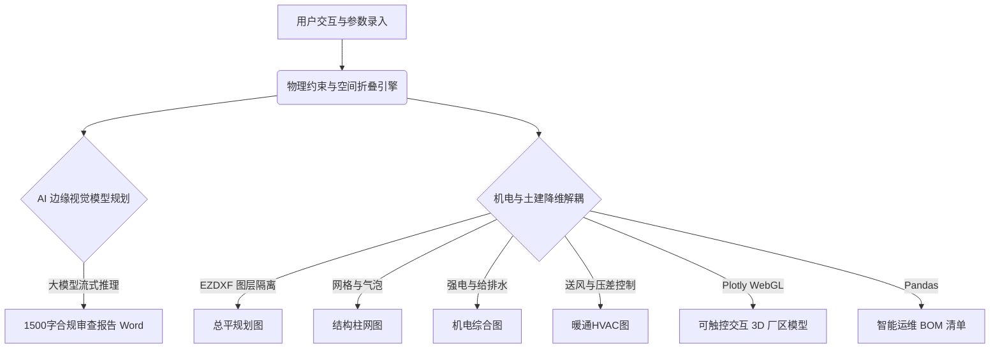
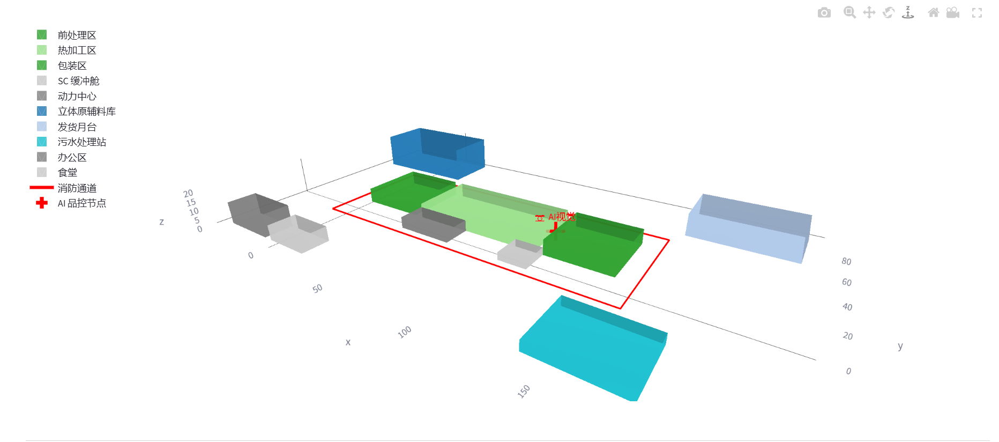
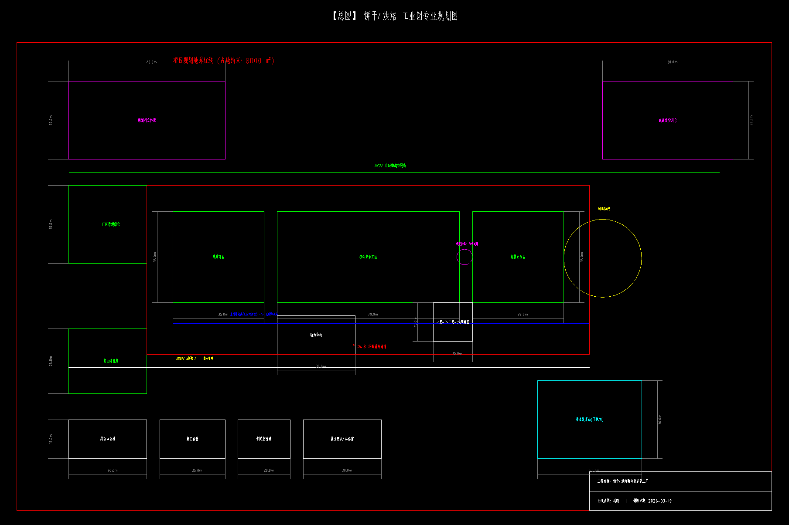
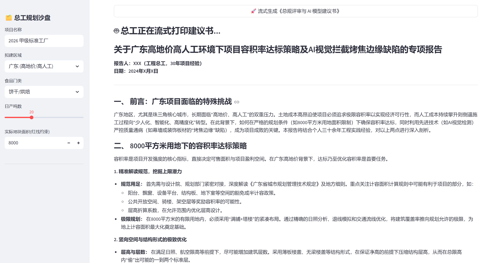

# 🏭 AI-Driven EPC Factory Designer (工业元宇宙总图基座)


本项目是一个专为工程总包（EPC）、规划院及食品企业打造的**“售前拿单与工程推演核武器”**。通过物理规则推演与大模型 AI 的深度融合，将需要专业工程师数周才能完成的规划工作，压缩至**秒级交付**。

## 🎯 商业推演与 MVP 现状 (Business Value & MVP Status)

> **💡 当前阶段**：本项目目前处于 **MVP (Minimum Viable Product) 概念验证与沙盒测试阶段**。

本系统不仅是工程代码的堆砌，更是针对传统 EPC（工程总包）行业“售前成本高、响应慢”痛点的商业化 AI 解决方案推演：
* **💰 理论 ROI 推演 (金算视角)**：传统 EPC 规划院响应一个初步厂区方案需专业工程师耗时 1-2 周。本 MVP 系统通过“物理引擎+AI 推理”，将出图与报告生成压缩至**秒级**。若投入实际生产，理论上可为企业**缩减 90% 的售前人力试错成本**，极大提升拿单转化率。
* **🛡️ 合规风控兜底 (账总视角)**：针对大模型处理空间逻辑易产生“幻觉”的短板，系统没有完全依赖 AI，而是硬编码了国家 SC 洁净认证底线（如：强制物理隔离污染区、下风向污水处理），确保 AI 规划输出100%符合现实工程合规要求。

## ✨ 核心特性 (Core Features)

* **📏 参数化空间折叠引擎**：输入地块面积（红线约束），系统自动进行 3D 体量缩放与容积率推演。
* **📐 甲级标准 CAD 矩阵**：一键导出包含图框、全域尺寸标注与结构轴号的 4 张专业 DXF 图纸（总平/结构/机电/暖通）。
* **🛡️ 国家 SC 认证合规防线**：内置极其严苛的食品级规范，强制规划一/二更风淋缓冲舱，以及下风向污水处理站。
* **👁️ 边缘视觉 AI 赋能**：在包装区咽喉处自动部署机器视觉锚点，精准规划缺陷剔除拦截网（如：包装漏气、异物混入）。
* **⚡ 极速流式报告生成**：结合实时大宗商品行情（钢价/铜价）与地域系数，实时打字机式输出 1500 字多专业协同审查报告。

## 🏗️ 架构拓扑 (Architecture)



## 👀 系统路演实况 (System Demo)

### 1. 🌐 3D 厂区数字孪生与 AI 节点推演
系统内置 WebGL 引擎，实时渲染带建筑体量与 AI 视觉拦截节点（红十字标识）的 3D 可交互沙盘。


### 2. 📐 甲级标准 CAD 矩阵生成
告别传统脚本的“毛坯图”。一键生成包含严格占地红线约束、全域工程尺寸标注、以及标准出图图框的 DXF 施工基图。


### 3. 🤖 领域大模型流式合规审查
深度融合地域系数与食品合规标准（如 SC 洁净要求），实时流式输出具有顶层总工视角的专业建议书。


---

## 🚀 极速启动 (Quick Start)

**1. 克隆项目与安装环境**
```bash
git clone [https://github.com/YourUsername/AutoFood_CAD_System.git](https://github.com/YourUsername/AutoFood_CAD_System.git)
cd AutoFood_CAD_System
pip install -r requirements.txt
```

**2. 配置 AI 密钥**
在根目录创建 `.streamlit/secrets.toml`：
```toml
DEEPSEEK_API_KEY = "sk-您的专属密钥"
```

**3. 点火启动**
```bash
streamlit run web_app.py
```

> **👨‍💻 总工免责声明**：本系统导出的图纸矩阵（LOD 200-300）用于极速锁定规划方向与评估投资。实际施工蓝图（LOD 400）仍需由持证 BIM 工程师与结构工程师深化出具。
